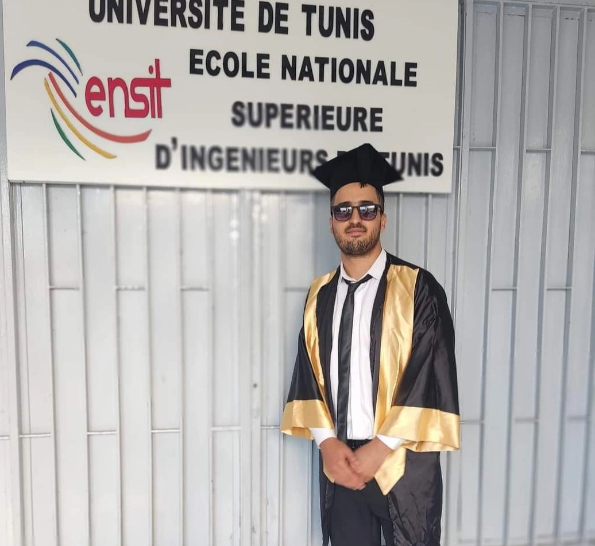

  

  <a href="https://www.linkedin.com/in/boulaabi-meher/" style="margin: 0 10px;">LinkedIn</a> |
  <a href="https://orcid.org/0009-0000-6773-2781" style="margin: 0 10px;">ORCID</a> |
  <a href="https://www.researchgate.net/profile/Boulaabi-Meher" style="margin: 0 10px;">ResearchGate</a> |
  <a href="https://scholar.google.com/citations?user=9trlmwkAAAAJ" style="margin: 0 10px;">Google Scholar</a> |
  <a href="https://github.com/boulaabimeher" style="margin: 0 10px;">GitHub</a> |
  <a href="mailto:boulaabi@cril.fr" style="margin: 0 10px;">Email</a>

---

## 👤 Research Profile

Doctoral researcher specializing in **interpretable deep learning for medical imaging**, with focus on vision transformers and explainable AI. Published first-author papers at **AIME 2025** and **IEEE AICCSA 2024**. 

**Teaching Experience:** 63h of TD/TP in AI, machine learning, and computer vision, delivered in French and English at university level through an academic training project. 

**Current Supervision:** Co-supervising 3 Master's students in medical imaging and NLP research.

### Research Focus

My current research focuses on developing **Concept Bottleneck Models (CBMs)** for interpretable medical imaging, with particular emphasis on creating clinician-verifiable reasoning systems that bridge high-performance deep learning with explainable clinical decision support.

### Career Objective

I am actively seeking an **ATER (Attaché Temporaire d'Enseignement et de Recherche)** position to further develop my research in interpretability and explainable AI while contributing to academic teaching. I am highly motivated to teach courses in machine learning, deep learning, computer vision, and AI for healthcare, sharing my research experience with the next generation of students.

---

  <a href="education.html" style="display: inline-block; background-color: #FFCC00; color: #2e2e2e; padding: 12px 24px; margin: 5px; text-decoration: none; border-radius: 5px; font-weight: bold;">📚 Education & Research</a>
  <a href="publications.html" style="display: inline-block; background-color: #FFCC00; color: #2e2e2e; padding: 12px 24px; margin: 5px; text-decoration: none; border-radius: 5px; font-weight: bold;">📄 Publications</a>
  <a href="teaching.html" style="display: inline-block; background-color: #FFCC00; color: #2e2e2e; padding: 12px 24px; margin: 5px; text-decoration: none; border-radius: 5px; font-weight: bold;">🎯 Teaching</a>
  <a href="skills.html" style="display: inline-block; background-color: #FFCC00; color: #2e2e2e; padding: 12px 24px; margin: 5px; text-decoration: none; border-radius: 5px; font-weight: bold;">💻 Skills</a>
  <a href="professional.html" style="display: inline-block; background-color: #FFCC00; color: #2e2e2e; padding: 12px 24px; margin: 5px; text-decoration: none; border-radius: 5px; font-weight: bold;">💼 Professional</a>

---

## 🔬 Recent Highlights

### 📄 Latest Publications

**Enhancing Diabetic Retinopathy Classification with Swin Transformer** (AIME 2025)  
First-author paper achieving 97.40% accuracy on IDRiD dataset using Swin Transformer architecture.

**Advanced Segmentation of Diabetic Retinopathy Lesions** (IEEE AICCSA 2024)  
First-author paper achieving 99% segmentation accuracy using DeepLabv3+ on IDRiD dataset.

### 🔍 Current Research

Working at **CNRS CRIL UMR 8188** (France) on developing Concept Bottleneck Models for interpretable medical imaging with clinician-verifiable reasoning.

### 👥 Student Supervision

Currently co-supervising 3 M2 students:
- Automated Melanoma Detection using Deep CNNs
- Comparative Analysis of Architectures for DR Detection with XAI
- Fine-Tuning LLMs for English-Arabic Medical Translation

---

## 📊 GitHub Statistics

  
  

---

## 📫 Contact Information

**Email:** [boulaabi@cril.fr](mailto:boulaabi@cril.fr)  
**Location:** Lens, Hauts-de-France, France  
**Phone:** +33 7 82 92 00 74

**Expected PhD Defense:** December 2026

---

  <i>Last updated: February 2026</i>

