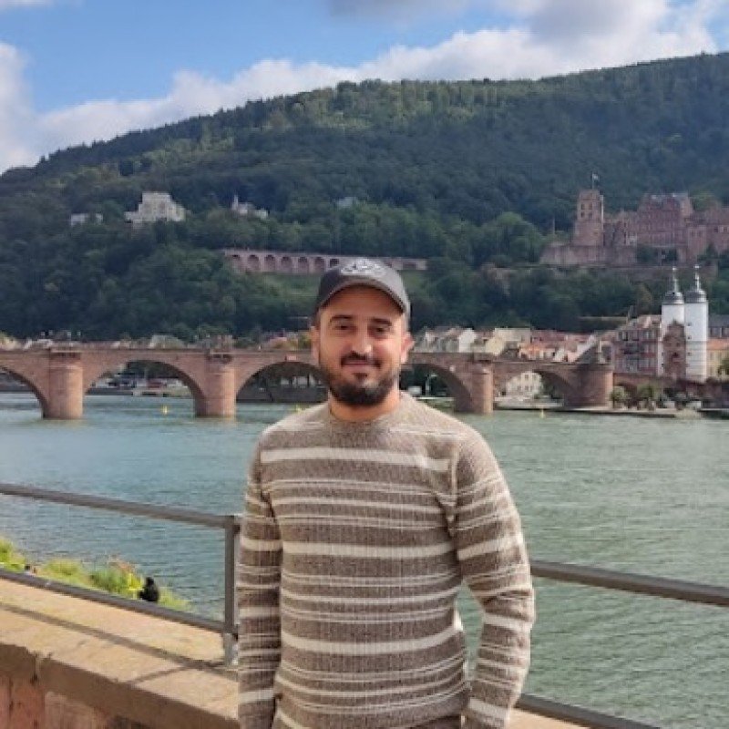

  

  <a href="/CV.pdf" download style="display: inline-block; background-color: #FFCC00; color: #2e2e2e; padding: 10px 30px; text-decoration: none; border-radius: 5px; font-weight: bold; margin: 10px 0;">📄 Download CV (PDF)</a>

  <a href="https://www.linkedin.com/in/boulaabi-meher/" style="margin: 0 10px;">LinkedIn</a> |
  <a href="https://orcid.org/0009-0000-6773-2781" style="margin: 0 10px;">ORCID</a> |
  <a href="https://www.researchgate.net/profile/Boulaabi-Meher" style="margin: 0 10px;">ResearchGate</a> |
  <a href="https://scholar.google.com/citations?user=9trlmwkAAAAJ" style="margin: 0 10px;">Google Scholar</a> |
  <a href="https://github.com/boulaabimeher" style="margin: 0 10px;">GitHub</a> |
  <a href="mailto:boulaabi@cril.fr" style="margin: 0 10px;">Email</a>

---

  <a href="education.html" style="display: inline-block; background-color: #FFCC00; color: #2e2e2e; padding: 12px 24px; margin: 5px; text-decoration: none; border-radius: 5px; font-weight: bold;">📚 Education & Research</a>
  <a href="publications.html" style="display: inline-block; background-color: #FFCC00; color: #2e2e2e; padding: 12px 24px; margin: 5px; text-decoration: none; border-radius: 5px; font-weight: bold;">📄 Publications</a>
  <a href="teaching.html" style="display: inline-block; background-color: #FFCC00; color: #2e2e2e; padding: 12px 24px; margin: 5px; text-decoration: none; border-radius: 5px; font-weight: bold;">🎯 Teaching</a>
  <a href="skills.html" style="display: inline-block; background-color: #FFCC00; color: #2e2e2e; padding: 12px 24px; margin: 5px; text-decoration: none; border-radius: 5px; font-weight: bold;">💻 Skills</a>
  <a href="professional.html" style="display: inline-block; background-color: #FFCC00; color: #2e2e2e; padding: 12px 24px; margin: 5px; text-decoration: none; border-radius: 5px; font-weight: bold;">💼 Professional</a>

---

## 👤 Research Profile

Doctoral researcher in Computer Science, specializing in artificial intelligence applied to healthcare, at LaTICE Laboratory (Faculty of Sciences of Monastir, University of Monastir, Tunisia), under the co-supervision of Prof. Afef Kacem Echi (LaTICE, Tunisia) and Prof. Zied Bouraoui (CNRS CRIL, France).

**Doctoral Thesis:** "Explainable and Interpretable Deep Learning Models for Medical Image Diagnosis"

My research sits at the intersection of deep learning, model explainability (XAI), and ophthalmic imaging. The doctoral project aims to design clinical decision support systems that are not only high-performing but also interpretable by healthcare practitioners, leveraging advanced computer vision techniques (Vision Transformers, deep convolutional networks), transfer learning, and explainability methods (Grad-CAM, LIME, SHAP, Concept Bottleneck Models).

**Teaching Experience:** 289+ hours across multiple institutions (ISI Mahdia, ENSIT Tunis, Association Jeune Actif), covering subjects from fundamental programming (L1) to advanced deep learning (M2), delivered in French and English.

**Current Supervision:** Co-supervising 2 Master's students at ENSIT on medical imaging and XAI research.

### Research Focus

My current research focuses on developing **Concept Bottleneck Models (CBM)** for interpretable medical imaging. Unlike post-hoc methods (Grad-CAM, SHAP), CBMs integrate explainability directly into the model architecture by forcing the model to reason through interpretable concepts before producing a final prediction. This research also leverages LLMs to generate textual explanations from detected concepts, creating an interface between automatic prediction and medical expertise.

### Career Objective

I am actively seeking an **ATER (Attaché Temporaire d'Enseignement et de Recherche)** position to further develop my research in interpretability and explainable AI while contributing to academic teaching. My multidisciplinary academic background (Master in Computer Science from ENSIT and Master in Embedded Systems from ISSATK, built upon a License in Computer Science and Electronics) provides me with broad technical expertise covering networks and telecommunications, web and mobile development, system and embedded programming, databases, operating systems, and digital electronics.

This versatility, combined with deep specialization in AI and model explainability, represents a decisive pedagogical asset for an ATER position: it enables me to teach with confidence and legitimacy across a wide variety of modules, from fundamental courses at License level to advanced Master modules (machine learning, deep learning, big data, signal processing), well beyond my specific research specialty.

---

## 🔬 Recent Highlights

### 📄 Latest Publications

**Enhancing Diabetic Retinopathy Classification with Swin Transformer** (AIME 2025)  
First-author paper achieving 97.40% accuracy on IDRiD dataset using Swin Transformer architecture.

**Advanced Segmentation of Diabetic Retinopathy Lesions** (IEEE AICCSA 2024)  
First-author paper achieving 99% segmentation accuracy using DeepLabv3+ on IDRiD dataset.

### 🔍 Current Research

Working at **CNRS CRIL UMR 8188** (France) on developing Concept Bottleneck Models for interpretable medical imaging with clinician-verifiable reasoning.

### 👥 Student Supervision

Currently co-supervising 3 M2 students:
- Automated Melanoma Detection using Deep CNNs
- Comparative Analysis of Architectures for DR Detection with XAI
- Fine-Tuning LLMs for English-Arabic Medical Translation

---

## 📊 GitHub Statistics

  
  

---

## 📫 Contact Information

**Email:** [boulaabi@cril.fr](mailto:boulaabi@cril.fr)  
**Location:** Lens, Hauts-de-France, France  
**Phone:** +33 7 82 92 00 74

**Expected PhD Defense:** December 2026

---

  <i>Last updated: February 2026</i>

